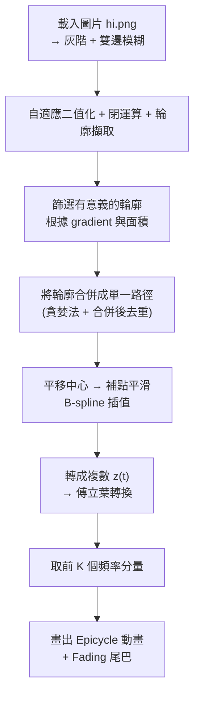

## 前言
大二的時候學了Fourier轉換，剛好看到網路上有一些 [Fourier Drawing 動畫](https://www.youtube.com/watch?v=r6sGWTCMz2k)。
<iframe width="560" height="315" src="https://www.youtube.com/embed/r6sGWTCMz2k?si=JPkv30IibkZFTwmT" title="YouTube video player" frameborder="0" allow="accelerometer; autoplay; clipboard-write; encrypted-media; gyroscope; picture-in-picture; web-share" referrerpolicy="strict-origin-when-cross-origin" allowfullscreen></iframe>

那時候用 Matlab 手刻了一個類似的方法，沒有用函式庫。我記得它花了我一整個晚上 (till 早上六七點)。程式碼沒有留著，但是有錄影。
<iframe width="560" height="315" src="https://www.youtube.com/embed/5V3DET2KMZc?si=4Eo9Yc2R3Ze1dZ91" title="YouTube video player" frameborder="0" allow="accelerometer; autoplay; clipboard-write; encrypted-media; gyroscope; picture-in-picture; web-share" referrerpolicy="strict-origin-when-cross-origin" allowfullscreen></iframe>

還記得那時候主要遇到了一些問題：
1. 要怎麼從目標圖片Sample出適當的discrete的點，這個部分那時候我是一個一個點出來。
2. sample 出適當的點之後，進行傅立葉轉換，忘了為何，轉換結果在時間是discrete的時候位置會對，但其他時候會跑掉。有點像是用五次函數解 $y=ax+b ,when (x,y)=(0,0),(1,1)$ 最後會 overfitting 一樣。 我花了一些時間調整要保留的頻率分量數目，然後用內插法增加原本的資料數目。最後才完成上面的影片

時隔六年，這次我要復刻出我當時的程式碼，並改進當時遇到的問題。

## 成果
hi.png


成果
<iframe width="560" height="315" src="https://www.youtube.com/embed/PK8avQFDkCM?si=Kr_J24ylqYeG01cS" title="YouTube video player" frameborder="0" allow="accelerometer; autoplay; clipboard-write; encrypted-media; gyroscope; picture-in-picture; web-share" referrerpolicy="strict-origin-when-cross-origin" allowfullscreen></iframe>

## 使用說明

### 📂 圖片準備

將你想要畫成傅立葉動畫的圖像命名為 `hi.png`，放在與主程式相同的資料夾中。  
建議圖片為黑白線稿、邊緣清晰的圖像，例如簽名、塗鴉、簡筆畫。

如果不是黑白線搞，可能會有非預期的成果
，例如川普


---

### 🖥️ 執行方式

請先安裝必要的 Python 套件：

```bash
pip install numpy matplotlib opencv-python scipy
```

接著執行主程式（檔案中已有寫死讀取 `hi.png`）：

```bash
python fourier_animator.py
```

程式會自動開啟一個動畫視窗，展示 Epicycle（旋轉向量）如何逐步重建原始輪廓的過程。

---

### 🛠️ 可調參數

你可以在程式最上方調整以下參數，影響畫面細節與動畫效果：

| 參數             | 說明                                       |
|------------------|--------------------------------------------|
| `kernel_size`     | 模糊程度（數字越大越模糊）                 |
| `blockSize`       | 自適應閾值演算法的區塊大小（必須是奇數）   |
| `C`               | 閾值調整用常數（亮度微調）                 |
| `dilate_iter`     | 邊緣擴張次數（可強化輪廓）                 |
| `min_area`        | 最小輪廓面積（過小的會被過濾掉）           |
| `K`               | 保留的傅立葉頻率個數（越多越精細）         |
| `frame_step`      | 動畫速度（越大越快但不夠平滑）             |
| `tail_ratio`      | 畫筆尾巴長度的比例（0.0 ~ 1.0）            |

---

### 🔍 注意事項

- 程式會將所有輪廓合併成單一路徑進行傅立葉轉換，因此圖片中應只有一個主要物件（或是彼此接近的輪廓）。
- 輪廓合併的過程是自動進行的，也可以打開程式中的 debug 區塊，觀察每一步的合併視覺化過程。

<!-- ## 問題描述
給定一個圖形，具有明顯輪廓，image.png


目標是生成類似 [影片中20:27秒](https://youtu.be/r6sGWTCMz2k?feature=shared&t=1227) 的動畫。


我沒有打算像影片中那樣模擬筆畫，因為這需要我手動調整input資料。我只打算生成輪廓

 -->

## 程式規劃


各階段詳細說明
1. 載入與預處理
    載入灰階圖 hi.png使用雙邊濾波來去除雜訊、保留邊緣自適應閾值產生黑白圖 → 閉運算 + 輪廓擷取
2. 篩選輪廓
    使用 Sobel 計算圖像梯度保留邊緣強度夠高 + 面積大於門檻的輪廓
3. 輪廓合併
    每條輪廓先補齊為閉合狀利用最短距離合併策略，兩兩輪廓合併成單一路徑過程中會旋轉點列起始點，避免跳接
4. 平滑與中心化
    將合併後的點轉換為以中心為原點的座標用 B-spline 插值來補點、平滑路徑轉換成複數表示法 $z(t)$ 為傅立葉輸入
5. 傅立葉分解
    使用 FFT 對 $z(t)$ 做離散傅立葉轉換取出振幅最大的 K 個頻率成分來重建訊號
6. Epicycle 動畫
    每個頻率成分對應一個旋轉向量組合所有向量畫出原始路徑的動畫加上 fading 尾巴效果模擬筆跡感

